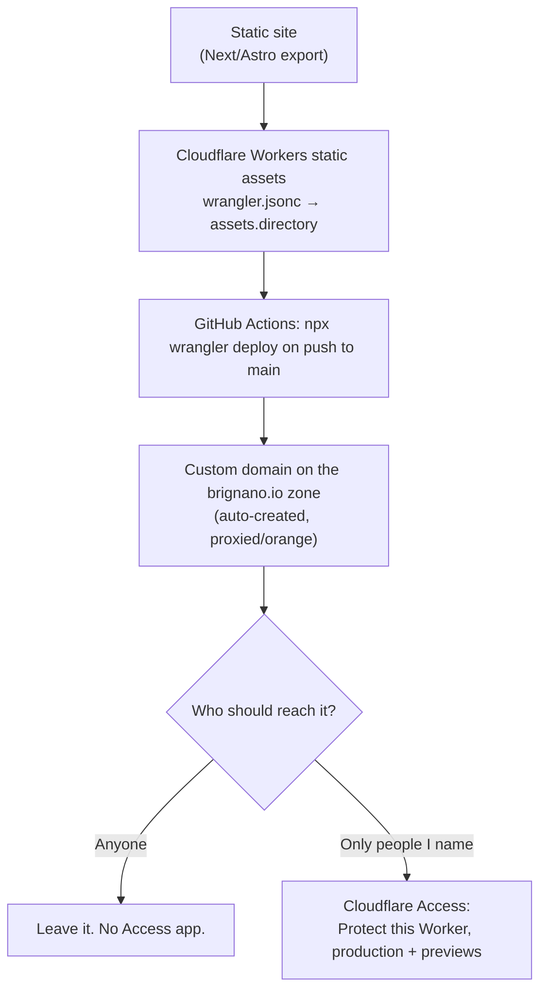

# Global context — Anthony Brignano

## Devices
- MacBook (primary development machine)
- Windows desktop (no WSL)
- Linux homelab server (GMKtec M5 Ultra — Ryzen 7 7730U, 16GB DDR4, 512GB NVMe)

## Active repos
- `homelab` — Proxmox, Docker, Portainer, Tailscale, Grafana, Prometheus, Ollama, Open WebUI, PostgreSQL
- `ideas` — TSDs, proposals, and captured ideas across all domains
- `ai-tools` — this tooling, installed globally on every device
- `design` — **the design system**. Every UI I build styles from this. See below.

## How I work
- Spec-driven development: always draft and approve a TSD before implementing anything
- I have ADHD — I work on multiple things in parallel, so keep track of where we are and surface it clearly
- I self-host everything personally — always factor in hosting cost, complexity, and maintenance burden before proposing a solution
- I value clean UX and performance over feature count
- Ideas can come from anywhere — a sentence is enough to start a TSD

## Styling — always use the design system

**Before writing any UI, styling, or colour, read
[`brignano/design`](https://github.com/brignano/design) — `DESIGN.md` for the
rules, `tokens.css` for the values.** It is public, versioned, and already the
single source of truth for `brignano.io` and `life`.

Install it rather than copying values:

```jsonc
"@brignano/design": "github:brignano/design#v0.1.0"
```

```css
@import "@brignano/design/tokens.css";
```

No build step? Use jsDelivr:
`https://cdn.jsdelivr.net/gh/brignano/design@v0.1.0/tokens.css`

The rules that matter most, so you can apply them without reading everything:

- **One hue, one meaning.** `--i-*` = you can act on this. `--success` =
  settled/done. `--attention` = this wants you (warning *and* now/next — they
  are the same message at different volumes). `--danger` = something broke.
  `--mark` = identity, and it inks a *graphic* only, never a control.
- **Never hardcode a hex outside `tokens.css`.** A literal survives a theme
  change silently. That is how a set of status pills stayed light grey in dark
  mode for months.
- **Colour is a surface, not text.** Use the `-surface` / `-line` wash tokens
  behind near-ink text; use the `-ink` step when a state must be a label.
- **Never colour alone** — every state ships with an icon and a word.
- **Two tiers.** Tool tier is the default; a marketing surface opts in with
  `class="tier-marketing"`. Colour is identical across both.
- **Tailwind consumers must set `data-theme` alongside `.dark`** — Tailwind
  keys off the class, the tokens key off the attribute. See `DESIGN.md` §10.
- **Charts** are the one place restraint does not apply: use `--chart-1..8` in
  fixed order, never cycled, assigned per entity and **per chart**.

If a project genuinely needs something the system lacks, add it to
`brignano/design` and bump the pin — do not invent a local value.

## Hosting & access — one pattern, one decision

**Read this before standing up any site or subdomain.** There is not a "public
pattern" and a "private pattern". There is one hosting pattern, and a separate
access decision layered on it. Conflating them is how a site meant to be private
ends up public.



**Default to private.** `life`, `trips`, `hoststats` and anything holding
personal data are Access-gated. Public is the deliberate exception, not the
fallback — if you cannot tell which one applies, ask.

### Rules that are load-bearing
- **Protect the *Worker*, not the hostname.** Since 2026-08-14 Access attaches
  to the Worker itself and covers its routes, custom domains, `workers.dev`
  URL and previews — nothing to keep in sync when domains change. Only drop to
  a hostname-based self-hosted app if you need WebSockets (worker-level
  policies 403 the upgrade) or deliberately want one hostname open.
- **Cover previews too.** A preview URL serves the same app; leaving it open
  defeats the point.
- **Create the Access application BEFORE any DNS resolves.** A Worker is live
  on `workers.dev` from its first deploy and a custom domain serves the moment
  it is attached. The account-wide Default-Deny is **off** (it rejected
  already-authorised requests — Error 1050), so an unprotected hostname is
  *served*, not blocked. There is no backstop.
- **Proxy status is not uniform.** Cloudflare-hosted hostnames must be
  **orange/proxied** — Access only enforces on proxied traffic, and a
  grey-cloud record bypasses it entirely. Vercel hostnames (`brignano.io`,
  `www`) must stay **grey/DNS-only** or certificate issuance breaks.
- **Never set MFA or session policy account-wide.** Org-level TOTP applies to
  every app and every person, including family. Anything that changes the login
  experience belongs on the individual application.
- **One-time PIN is the default sign-in method** for family and friends — no
  IdP to configure. Google is worth it if everyone has an account. Facebook is
  a dead end for a personal site (Advanced Access needs business verification).

### Where the worked example lives
[`hoststats/docs/DEPLOYING.md`](https://github.com/brignano/hoststats/blob/main/docs/DEPLOYING.md)
is the reference implementation — hosting, GitHub Actions secrets/variables,
custom domain, Access, and a symptom→cause table. Copy it rather than
re-deriving. `life/DEPLOY.md` covers the same ground for a Cloudflare Pages
project.

### Current estate
| Site | Host | Access |
|---|---|---|
| `brignano.io`, `anthonybrignano.com` | Vercel (static Next export), grey-cloud | public by design |
| `life.brignano.io` | Cloudflare **Pages** (`life-5sy`) | Access — me only |
| `trips.brignano.io` | Workers static assets — **not yet created** | Access — family + friends |
| `hoststats.brignano.io` | Cloudflare **Workers** static assets | Access — family |

New sites use **Workers static assets**, not Pages — Cloudflare's own docs now
open the Pages section with "Start new projects with Workers". `life` predates
that; migrating it is worth doing but is not a prerequisite for anything, and
should follow `trips` rather than lead it, since a migration creates new
hostnames that must be Access-covered before they serve.

**Access is per site, not per account.** Each site is its own Worker with its
own Access application and its own policy — `hoststats` allows family, `life`
allows only me, `trips` allows family and friends. Protecting one Worker says
nothing about the others. If you want the default inverted, **Protect all
Workers** (Workers & Pages → Protect all Workers) makes every existing and
future Worker private, with an explicit per-Worker bypass to publish one.

## Communication preferences
- Short, direct responses
- No unnecessary caveats or softening
- Use Mermaid diagrams when explaining flows or architecture
- If something I propose is a bad idea, say so directly with the reason

## Decision defaults
- Prefer self-hosted over SaaS when complexity is comparable
- Prefer simple and maintainable over clever
- Prefer proven tools over new ones unless there's a clear reason
- Always consider: what does this cost to run monthly?

## Custom commands & output styles
Installed globally from the `ai-tools` repo. Slash commands live in `commands/`
(each self-describes via frontmatter — run `/` to list them); reusable personas live
in `output-styles/` (`/output-style` to switch). This list is intentionally not
duplicated here — the directories are the source of truth.
