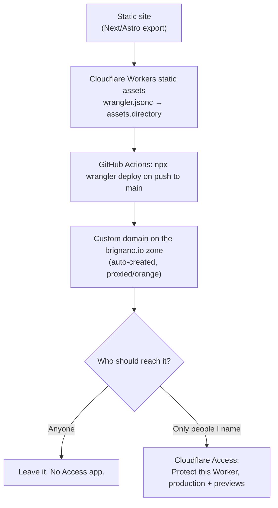

# Hosting & access — one pattern, one decision

**Read this before standing up any site or subdomain.** There is not a "public
pattern" and a "private pattern". There is one hosting pattern, and a separate
access decision layered on it. Conflating them is how a site meant to be private
ends up public.

**Default to private.** `life`, `trips`, `hoststats` and anything holding
personal data are Access-gated. Public is the deliberate exception, not the
fallback — if you cannot tell which one applies, ask.

## Rules that are load-bearing
- **Protect the *Worker*, not the hostname.** Since 2026-08-14 Access attaches
  to the Worker itself and covers its routes, custom domains, `workers.dev`
  URL and previews — nothing to keep in sync when domains change. Only drop to
  a hostname-based self-hosted app if you need WebSockets (worker-level
  policies 403 the upgrade) or deliberately want one hostname open.
- **Cover previews too.** A preview URL serves the same app; leaving it open
  defeats the point.
- **Create the Access application BEFORE any DNS resolves.** A Worker is live
  on `workers.dev` from its first deploy and a custom domain serves the moment
  it is attached.
  - **Workers do have a backstop** (corrected 2026-08-24). The account-wide
    **Workers** Access policy — Workers & Pages → Cloudflare Access, scope *All
    traffic* — is Enabled and covers every Worker's production and preview
    traffic from the first deploy. Do not confuse it with the Zero Trust
    *"block traffic to all domains in this account"* Default-Deny, which is
    **off** and stays off: that one rejected already-authorised requests with
    Error 1050.
  - **Nothing else has one.** A Pages project, or any hostname that is not a
    Worker, is served unprotected — so the destination list on a hostname-based
    application still has to be right.
  - **The ordering rule holds anyway**, for a different reason: the
    account-wide policy allows a single identity, so a Worker deployed before
    its own application exists is *private to me*, not shared. The per-Worker
    policy is what lets other people in, not what keeps strangers out.
- **A per-Worker application governs — account-wide membership is not a grant**
  (verified 2026-08-24). Once a Worker has its own Access application, that
  application decides on its own. An address on the account-wide policy but
  absent from the Worker's policy is refused with *"That account does not have
  access"*; adding it to the Worker's policy admits it immediately. **Put every
  identity that needs access on the application's own policy, mine included.**
- **Two Allow policies, not one list.** `Me` (my address) and `Family` or
  whoever else. The second list is the one that churns — someone added for a
  trip, someone removed later, the whole thing rebuilt for a new identity
  provider — and my own access should never live inside the list I keep
  editing. Separate policies also let their session duration differ from mine.
- **Proxy status is not uniform.** Cloudflare-hosted hostnames must be
  **orange/proxied** — Access only enforces on proxied traffic, and a
  grey-cloud record bypasses it entirely. Vercel hostnames (`brignano.io`,
  `www`) must stay **grey/DNS-only** or certificate issuance breaks.
- **Never set MFA or session policy account-wide.** Org-level TOTP applies to
  every app and every person, including family. Anything that changes the login
  experience belongs on the individual application.
- **One-time PIN is the default sign-in method** for family and friends — no
  IdP to configure. Google is worth it if everyone has an account. Facebook is
  a dead end for a personal site (Advanced Access needs business verification).

## Where the worked example lives
[`hoststats/docs/DEPLOYING.md`](https://github.com/brignano/hoststats/blob/main/docs/DEPLOYING.md)
is the reference implementation — hosting, GitHub Actions secrets/variables,
custom domain, Access, and a symptom→cause table. Copy it rather than
re-deriving. `life/DEPLOY.md` covers the same ground for a Cloudflare Pages
project.

## Current estate
| Site | Host | Access |
|---|---|---|
| `brignano.io`, `anthonybrignano.com` | Vercel (static Next export), grey-cloud | public by design |
| `life.brignano.io` | Cloudflare **Pages** (project `life`) | `Me` — verified enforcing 2026-08-24 |
| `trips.brignano.io` | Workers static assets — **not yet created** | `Me` + `Family` + `Trip friends` |
| `hoststats.brignano.io` | Cloudflare **Workers** static assets | **public** — `bypass` / everyone |

New sites use **Workers static assets**, not Pages — Cloudflare's own docs now
open the Pages section with "Start new projects with Workers". `life` predates
that; migrating it is worth doing but is not a prerequisite for anything, and
should follow `trips` rather than lead it, since a migration creates new
hostnames that must be Access-covered before they serve.

## Access: private by default, public on purpose

The account-wide Workers Access floor is **on** (Workers & Pages → Cloudflare
Access), set to the `Me` policy. Every Worker is therefore private from its
first deploy — including one you create tomorrow and forget about. A site is
public only because someone attached a **bypass** policy saying so.

Rules are evaluated most-specific-first, and a more specific rule **replaces**
the broader one rather than stacking with it:

1. Hostname or path application
2. Worker-level application
3. Account-wide floor

That third point is the one that bites: a Worker with its own policy no longer
consults the floor, so **attach `Me` alongside whatever audience a site admits**
or you lock yourself out of your own site.

**Audiences are reusable policies**, named for who they are rather than which
site uses them, under Zero Trust → Access controls → Policies:

| Policy | Who | Attached to |
|---|---|---|
| `Me` | just me | everything, plus the account-wide floor |
| `Family` | permanent people, every address each wants to use | `trips` |
| `Trip friends` | ad-hoc, created with the first real member | `trips` |

`hoststats` is the deliberate exception — an MIT-licensed public tool with a
live URL in its README, exempted with a `bypass` / `everyone` policy.

Adding a relative is one edit to `Family` and it lands on every site that
includes it. **Include rules are OR** — so one person holding two addresses is
just two entries, and a site admitting two audiences is just both policies
attached.

Two traps worth remembering:

- **Google sign-in matches the Google account's address.** Allow-listing
  someone's other email means Google sign-in fails for them even though the
  method is enabled. Ask which address they actually sign in with; list both if
  they want both routes.
- **Never set MFA or session policy account-wide.** Set session duration on the
  audience policy instead — it supersedes the app and global values, so family
  get long sessions everywhere without touching anyone else.

An IdP is only how someone proves they hold an address; enabling one never
widens who is allowed in.
